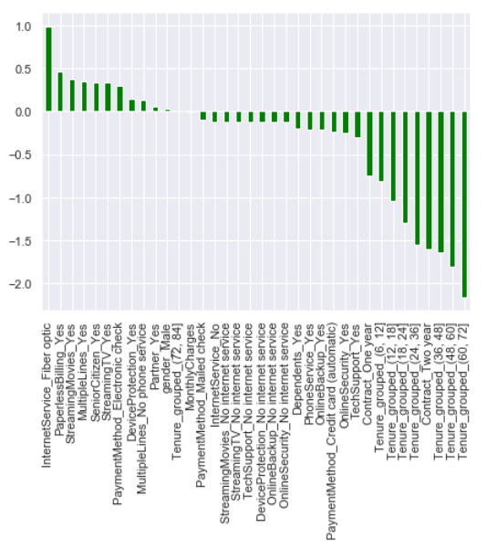

# Churn Prediction Model - Telecommunication

## A. Model Selection and Business Implications  

Exploratory analysis provided an initial view of the variables (such as fiber optic service and the seniority of citizens) that are associated with high churn rates. The variable importance according to our first model – logistic regression – highlighted not only the variables that are positively related but also those that have a weak (gender and partner) or a negative relation (longer tenures, longer contracts, and tech support) with churn.  

For model selection, it is important to look beyond the overall accuracy of the models. The selection process is driven by the worst case scenario, which is not being able to identify the customer who can discontinue. Hence, sensitivity (ability to identify true positives) is more important than the overall accuracy of the model.  

This approach becomes even more important in the datasets with very low instances of churn: in such cases, the model can achieve accuracy by accurately predicting the customers who would not churn but can have poor performance in identifying true positives.  

In our case, logistic regression is superior than the other models in terms of both accuracy and sensitivity; thus, we will select logistic regression on similar datasets to predict whether a customer is about to churn away or not.  

In the absence of logistic regression, we would have preferred decision trees to KNN, though KNN has better accuracy – because the decision tree has better sensitivity.  

It is important to note that while we are pursuing better sensitivity, we can’t totally ignore specificity (ability to identify true negatives). Poor specificity can lead to expenditure on attempts to retain the customers we would have retained them even otherwise (this is the impact of false positives). At what point does the marketing/product teams start focusing on sensitivity is a managerial decision, which will primarily be driven by budget allocation.  

Finally, these models can only uncover the areas of concern; it’s the managerial interpretations that drive the actions. For instance, strong positive association of fiber optic services with high churn possibility and high price of fiber optic services can’t be used to draw the conclusion that high price of the fiber optic services is the cause of the problem. Other possibilities such as poor performance of the product itself or the presence of the product in the wrong market segments can also be the reasons behind customer churn.  

## B. Data Source  
https://www.kaggle.com/blastchar/telco-customer-churn  

## C. Summary  

_Exploratory Data Analysis_  

1. Correlation matrix enabled us to know the correlation between different variables. Here, as we observed that ‘Total Charges’ has a strong positive correlation with other independent variables ‘Monthly Charges’ and ‘Tenure’, we removed Total Charges from our model.  

  

2. Histogram of Tenure of the customers who churned away and who continued showed that the customers with shirter tenure are more likely to churn.  

  

3. Similarly, histogram of Monthly Charges showed that customer who continued the services had lower monthly charges.  

  

4. We were able to capture the association between churn rates and monthly charges effectively using a Kernel Density Estimation (KDE) plot.  

  

5. Gender and subscription to Phone Service didn’t have a strong association with Churn rates.  

  

6. On the other hand, seniority, contract-length, and mainly internet service type had strong association with churn rate.  

  

  

It can be observed in the box plot that the Fiber Optic internet service are more expensive than the DSL internet services.  

_Machine Learning Models and Model Selection_  

1. Logistic Regression

###### ROC Curve  

  

###### Confusion Matrix and Classification Report  

  

###### Variable Importance  

  

The weights of the variables in the variable importance chart aligns with our exploratory analysis.  
- Fiber optic internet service is strongly associated with higher churn rates.  
- Seniority of the people have a positive relation with churn rates.  
- Longer tenures have a negative relationship with churn rates.  
- Churn rates diminishes with additional services such as Online backup, Online Security, and Tech support.  

2. Decision Tree  

###### ROC Curve  

  

###### Confusion Matrix and Classification Report  

  

3. Random Forest  

###### ROC Curve  

  

###### Confusion Matrix and Classification Report  

  

4. KNN  

###### Accuracy for different number of neighbors  

  

###### ROC Curve: ######
As the accuracy on test data is the best in case of n=8, we have used n=8 in our model  

  

###### Confusion Matrix and Classification Report  

  

**Comparison of all the models**  

  

As mentioned earlier, we will need to focus not only on the accuracy of the model, but also on other metrics such as sensitivity and specificity (whichever is the worst case scenario). Finally, the sensitivity and specificity also depends on the proportion of the negative and the positive instances in the training dataset; model tends to become bias towards the instance (Yes or No / 1 or 0) that occur more frequently – an issue that we will encounter again in our natural language processing exercise.  
